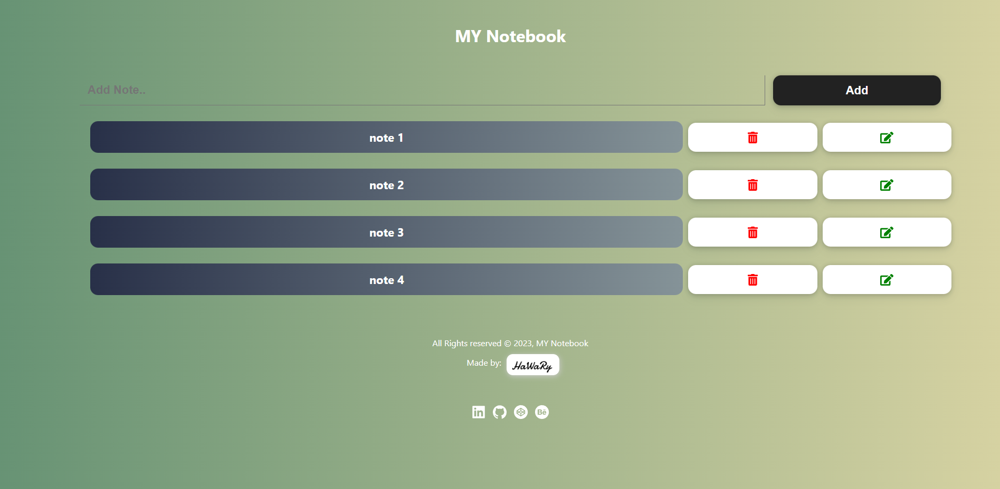

# MY Notebook

[](https://app.netlify.com/sites/mynotebook/deploys)

MY Notebook is a task list App that allows you to organize and add your tasks into your own notebook.

You can view the App from [here](https://mynotebook.netlify.app/)

 

## Demo

https://user-images.githubusercontent.com/69651552/218254050-a1d192cd-a7b4-45a2-a335-edf4746c6e2b.mp4

## Instructions, Building & Get Started 

    - 1- Fork, clone or download this repository to your local machine.
    - 2- Be sure that you install the Node.js environment in your machine.
    - 3- Open your terminal and be sure that you are inside the correct destination of the App, while you must be in the same path of the package.json file.
    - 4- Inside your terminal run these commands:-
    
        * to install dependencies.
        ```
        npm install
        ```
        * to start the server.
        ```
        npm start
        ```
    - 5- Once the App server is running, visit (localhost:3000) in the browser to view the App and now you can treat with it as shown above in the Demo.
    - 6- You can also see a live preview of the App from this link (https://mynotebook.netlify.app/)

## Built With

* HTML
* CSS
* JS

## Libraries & Packages

* [Font Awesome](https://fontawesome.com/)
* [React Icons](https://react-icons.github.io/react-icons/)

## Frameworks 

* [React.js](https://reactjs.org/)  

## Author

* [Mohamed Elhawary](https://www.linkedin.com/in/mohamed-elhawary14/) 

## Contact me through my social accounts

* Email: mohamed.k.elhawary@gmail.com
* [LinkedIn](https://www.linkedin.com/in/mohamed-elhawary14/)
* [Github](https://github.com/Mohamed-Elhawary)  
* [Behance](https://www.behance.net/mohamed-elhawary14)
* [Codepen](https://codepen.io/Mohamed-ElHawary) 

## License

Licensed under the [MIT License](LICENSE)
